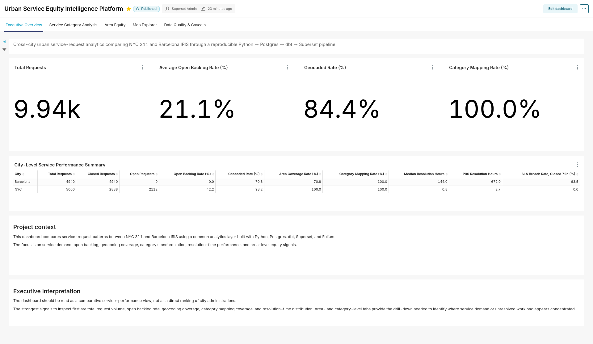
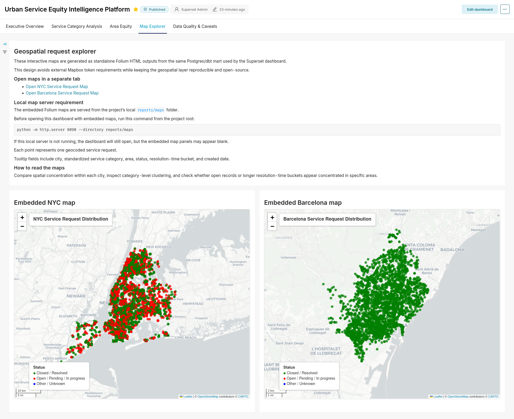

# Urban Service Equity Intelligence Platform

A reproducible analytics engineering and BI project for comparing urban service request patterns across US and European cities.

The project transforms heterogeneous municipal service request data into standardized, dashboard-ready models for monitoring service demand, backlog, resolution performance, and geographic distribution.

**Core stack:**

```text
Python ingestion → Postgres → dbt → Superset → Docker Compose
```

---

## Project Objective

Urban service request systems, such as 311 platforms and municipal customer service portals, generate operational data about issues reported by residents. These datasets can reveal differences in service demand, workload pressure, backlog, resolution performance, and geographic concentration across neighborhoods and cities.

This project builds a cross-city analytics platform that standardizes urban service request data and presents it through an interactive BI dashboard.

The current version is a completed **v1 analytics engineering project** focused on:

- Multi-source public data ingestion
- Postgres-based storage
- dbt transformations
- Dashboard-ready mart models
- Superset BI reporting
- Geospatial service request visualization
- Reproducible local deployment with Docker Compose

---

## Current Scope

The current version focuses on selected US and European municipal service request datasets, including:

- NYC 311 service requests
- Barcelona IRIS service request data

The current analytical comparison focuses on NYC and Barcelona. Dublin remains a possible extension source, but it is not part of the current harmonized 2024 comparison dataset.

The project is designed as a portfolio-grade analytics engineering project rather than a one-off notebook analysis.

---


## Comparison Window and Data Coverage

Cross-city comparisons in the current version use a harmonized 2024 observation window covering **2024-01-01 to 2024-12-31** for NYC 311 and Barcelona IRIS service request data.

Barcelona also contains earlier source records in the loaded 2024 IRIS extract, but cross-city comparisons should be interpreted using the shared 2024 window. Longer city-specific coverage is retained for data coverage diagnostics and source-context checks, not for direct cross-city temporal comparison.

The dbt model `mart_data_coverage_diagnostics` exposes first/last request dates, record counts, geospatial coverage, and common-window validity for each city/source.

## Key Analytical Questions

The dashboard is designed to support questions such as:

- Which cities generate the highest volume of service requests?
- Which service categories dominate request activity?
- How does open backlog vary by city, category, and area?
- How does resolution performance differ across cities?
- Which areas show stronger operational pressure?
- Where are service requests geographically concentrated?
- Which patterns may indicate potential service equity concerns?

---

## Dashboard Preview

### Dashboard Overview



### Geospatial Service Request Distribution


---

## Example Insights

- NYC shows the highest service request volume among the included cities.
- Open backlog varies by city and service category.
- Certain request categories dominate operational workload.
- Geographic concentration suggests that service demand is not evenly distributed.
- Resolution-time buckets help separate quick operational closures from slower service processes.

---

## Architecture

```text
Public municipal service request data
        ↓
Python ingestion scripts
        ↓
Postgres database
        ↓
dbt staging and mart models
        ↓
Superset datasets and charts
        ↓
BI dashboard and exported dashboard artifacts
```

The project separates ingestion, storage, transformation, and visualization into distinct layers. This mirrors a practical analytics engineering workflow where raw source data is progressively transformed into trusted, dashboard-ready outputs.

---

## Repository Structure

```text
.
├── dbt/                         # dbt project for SQL transformations
├── docker/                      # Docker and Superset-related configuration
├── ingestion/                   # Python ingestion scripts
│   ├── common/                  # Shared ingestion utilities and connection checks
│   ├── nyc/                     # NYC 311 ingestion logic
│   ├── dublin/                  # Optional/legacy Dublin ingestion logic, not part of the current 2024 comparison
│   └── barcelona/               # Barcelona IRIS ingestion logic
├── reports/
│   ├── maps/                    # Generated static map/report artifacts
│   ├── screenshots/             # Dashboard screenshots used in this README
│   └── superset_exports/        # Exported Superset dashboard ZIP files
├── docker-compose.yml           # Local Docker Compose environment
├── README.md                    # Project documentation
└── .env.example                 # Environment variable template
```

---

## Data Pipeline

### 1. Python Ingestion

The ingestion layer collects and prepares city-level service request data before loading it into Postgres.

The ingestion scripts are responsible for:

- Reading source datasets
- Handling city-specific schemas
- Normalizing key fields
- Preparing date, status, category, area, and location fields
- Loading data into Postgres
- Keeping source-specific logic separated by city

This design makes the project easier to extend with additional cities.

---

### 2. Postgres Storage

Postgres is used as the analytical database for the project.

It stores the ingested city-level service request data and provides the database layer used by dbt and Superset.

---

### 3. dbt Transformations

dbt is used to transform raw or prepared source tables into analytics-ready models.

The dbt layer supports:

- Source cleaning
- Staging models
- Standardized service categories
- Cross-city comparable fields
- Dashboard-ready mart models
- Metrics such as request volume, backlog rate, and resolution-time buckets

The dbt layer is central to the project because it converts heterogeneous municipal data into a common analytical structure.

---

### 4. Superset BI Dashboard

Apache Superset is used for the dashboard layer.

The dashboard includes:

- KPI summary metrics
- Service request volume analysis
- Open backlog rate
- Resolution-time analysis
- Service category comparisons
- City and area comparisons
- Geospatial service request distribution

The dashboard is exported and stored under:

```text
reports/superset_exports/
```

This makes the BI layer easier to review, reproduce, or migrate.

---

## Main Dashboard Outputs

The project produces dashboard-ready outputs for:

- Total service requests
- Requests by city
- Requests by standardized service category
- Open backlog rate
- Resolution-time buckets
- Area-level operational comparisons
- Latitude/longitude map points
- Cross-city service request comparison

Example mart-level outputs include:

```text
mart_service_requests
mart_request_summary
mart_request_map_points
```

---

## Local Setup

### 1. Clone the repository

```bash
git clone https://github.com/VStathopoulos/urban-service-equity-intelligence-platform.git
cd urban-service-equity-intelligence-platform
```

---

### 2. Create the environment file

```bash
cp .env.example .env
```

Edit `.env` if needed for local credentials, ports, database settings, or Superset configuration.

---

### 3. Start the local services

```bash
docker compose up -d
```

Check that the services are running:

```bash
docker compose ps
```

---

## Running the Pipeline

### 1. Test the Postgres connection

```bash
python -m ingestion.common.test_postgres_connection
```

---

### 2. Run ingestion scripts

Run the relevant ingestion scripts from the project root.

Examples:

```bash
python -m ingestion.nyc.ingest_nyc_311
python -m ingestion.barcelona.ingest_barcelona_iris
```

If script names change, use the files under the relevant city folder in `ingestion/`.

---

### 3. Run dbt

From the dbt project directory:

```bash
cd dbt
dbt debug --profiles-dir .
dbt run --profiles-dir .
dbt test --profiles-dir .
```

The dbt models prepare the cleaned, standardized, dashboard-ready tables used by Superset.

---

## Superset Dashboard

After the Docker services are running, access Superset locally through the configured Superset port.

The dashboard can be recreated or reviewed using the exported dashboard files in:

```text
reports/superset_exports/
```

The export artifact documents the dashboard state and supports reproducibility.

---

## Static Map Artifacts

Generated Folium map artifacts are stored in:

```text
reports/maps/
```

The Docker Compose stack includes a lightweight static map server that serves these artifacts locally at:

```text
http://localhost:8090
```

Running the stack is sufficient:

```bash
sudo docker compose up -d
```

This starts PostgreSQL, Superset, and the static Folium map server used by the embedded dashboard map panels. No separate manual static-map server command is required.


### H3 hex map methodology and interpretation

In addition to the point-level Folium maps, the project generates H3 hex hotspot maps from the same standardized geocoded request mart.

Generated hex map outputs:

- `reports/maps/barcelona_service_request_hex_map.html`
- `reports/maps/nyc_service_request_hex_map.html`

The H3 maps are produced by `scripts/export_folium_hex_maps.py` and validated by `scripts/check_folium_hex_map_outputs.py`.

Current export controls are documented in `.env.example`:

- `HEX_MAP_START_DATE=2024-01-01`
- `HEX_MAP_END_DATE=2025-01-01`
- `H3_RESOLUTION=8`
- `MIN_HEX_REQUESTS=5`

Interpretation notes:

- Hex maps aggregate only records with valid latitude/longitude.
- H3 resolution 8 is used for the first city-scale hotspot layer.
- Cells with fewer than the configured minimum request count are hidden to reduce visual noise.
- Hex color intensity represents request density within the selected 2024 window.
- The current hex maps show raw geocoded request concentration, not population-normalized demand.
- Density should therefore be interpreted alongside city size, reporting behavior, coordinate coverage, and dashboard KPI totals.
- The hex maps are currently generated as standalone static HTML artifacts; they are not yet embedded in the Superset dashboard.


### Folium map methodology and interpretation

The static Folium maps are generated from the standardized map-point mart and are intended as an exploratory geospatial layer, not as the primary source for total request-volume comparisons.

Current export controls are documented in `.env.example` and read by `scripts/export_folium_service_maps.py`:

- `MAP_START_DATE=2024-01-01`
- `MAP_END_DATE=2025-01-01`
- `MAX_POINTS_PER_CITY=8000`

This keeps the map export aligned to the harmonized 2024 cross-city comparison window and limits rendered points per city for browser performance.

Important interpretation notes:

- Only records with valid latitude/longitude are displayed on the Folium maps.
- The displayed map points may be a reproducible sample when a city has more valid coordinate records than the configured point cap.
- Point density therefore reflects both service-request activity and coordinate availability.
- Standardized service categories use stable colors across city maps, so the same category keeps the same legend color in each city.
- Dashboard KPI charts and dbt marts remain the better source for total-volume, status, backlog, and resolution-time comparisons.

---

## Skills Demonstrated

This project demonstrates practical experience in:

- Analytics engineering
- Python data ingestion
- Postgres-based analytical storage
- SQL transformation workflows
- dbt project structure
- dbt staging and mart modeling
- BI dashboard development
- Apache Superset chart configuration
- Docker Compose orchestration
- Cross-city metric standardization
- Data quality validation
- Geospatial analytics
- Operational KPI reporting
- Public-sector analytics use cases
- Portfolio-ready project documentation

---

## Why This Project Matters

Municipal service request data is operationally important but often fragmented across cities, systems, schemas, and reporting formats.

This project shows how heterogeneous public service datasets can be transformed into a common analytical structure and used for BI reporting.

The emphasis is not only on visualization, but on the full analytics workflow:

```text
source data → ingestion → database → transformation → dashboard-ready marts → BI insight
```

This makes the project relevant for analytics engineering, BI analytics, public-sector analytics, and data analyst roles requiring practical end-to-end pipeline experience.

---

## Current Status

Completed v1 includes:

- Docker Compose local environment
- Postgres database layer
- Python ingestion scripts
- Multi-city service request ingestion
- dbt transformation models
- Dashboard-ready mart tables
- Superset dashboard
- Dashboard export artifact
- Static map/report artifacts
- Dashboard screenshots
- Project README documentation

---

## Future Improvements

Planned extensions may include:

- Adding more cities and countries
- Adding demographic and socioeconomic equity indicators
- Adding automated scheduled refreshes
- Expanding dbt tests and documentation
- Adding dbt exposures for dashboard lineage
- Adding CI checks for ingestion and dbt models
- Improving neighborhood-level geospatial analysis
- Adding trend and seasonality analysis for service request demand
- Adding a short analytical findings report
- Publishing a dashboard walkthrough for portfolio review

---

## Portfolio Relevance

This project is designed to demonstrate the ability to build a practical analytics workflow from source data to BI output.

It is especially relevant for roles such as:

- Analytics Engineer
- BI Analyst
- Data Analyst
- Data Engineer with analytics focus
- Public-sector Data Analyst
- Operations Analytics Analyst

The project demonstrates not only chart creation, but also the underlying data preparation, modeling, standardization, and reproducibility needed for reliable BI reporting.

---

## Author

**Vasileios Stathopoulos**

Analytics / BI / Analytics Engineering portfolio project focused on reproducible data pipelines, dashboard-ready modeling, and public-service analytics.
